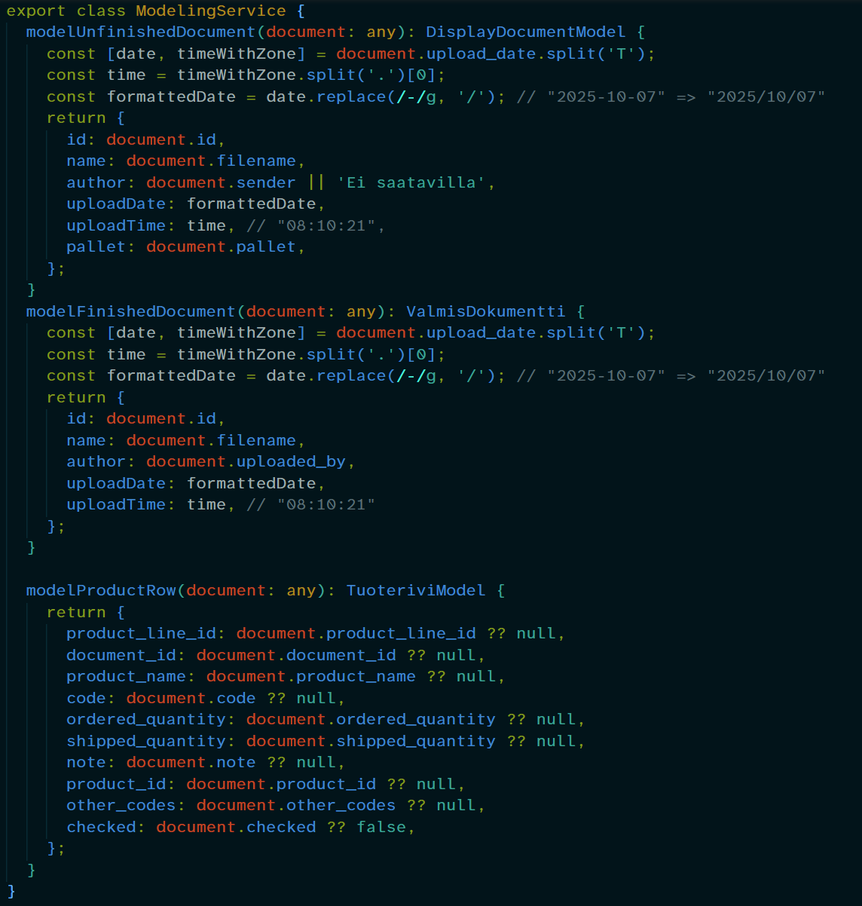
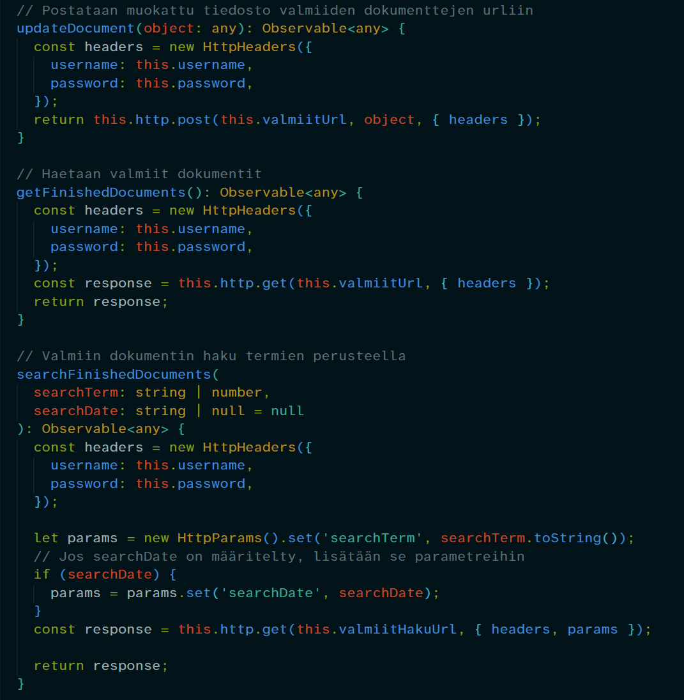
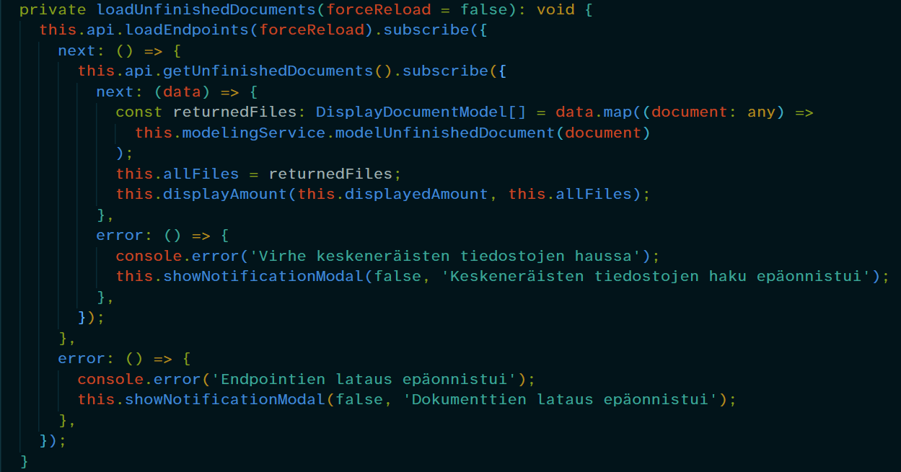
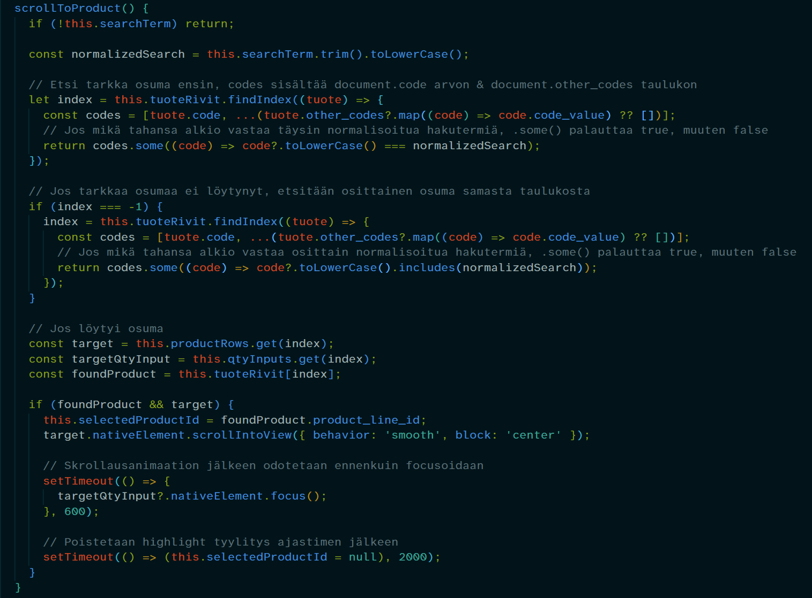
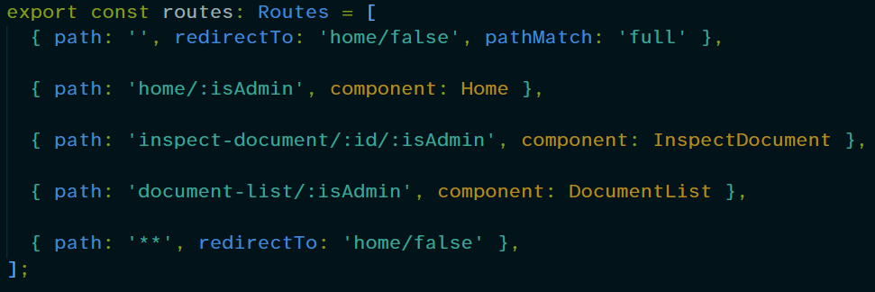

<link rel="stylesheet" href="/assets/css/syntax.css">

# DocuLens

DocuLens on lähetyslistojen digitalisointiohjelmisto, jonka avulla skannatut lähetyslistat voidaan ladata sovellukseen, niiden sisältävää tietoa voi tarkastella, muokata ja tallentaa. Esimiesnäkymässä (admin) pystyy myös näkemään ja tarkastelemaan valmiita, jo tarkastettuja lähetyslistoja.

# Alku

Projektin alussa itsellä ei ollut aiempaa osaamista Angularista. Ymmärrys hyvästä projektin kansiorakenteesta ja modulaarisesta kehityksestä oli vähäistä. API-rajapintojen hyödyntämisestä minulla oli vain perustason tietoa, ja GitHubin käyttö projektityöskentelyssä oli täysin uutta.

Tavoitteenani oli oppia frontend-sovelluskehitystä. Projektin edetessä tämä tavoite tarkentui Angular-frameworkin oppimiseen sekä pitkäkestoisessa projektissa toimimiseen ja ryhmätyöskentelyn kehittämiseen.

# Oma kontribuutio

Oma pääroolini oli frontend kehittäjä, joten olin vastuussa frontend puolen toiminnallisuudesta. Testaajan sivurooli siirtyi itseltä pois kesken projektin työmäärän jaon tasauksen seurauksena. Tällöin en kerennyt kuin hieman oppia ja tehdä testausta, nekin ainoastaan sovelluksen kotisivulle.

## Arkkitehtuuri

Kun projekti eteni ja koodimäärä kasvoi, opin käyttämään enemmän eriytettyjä malleja ja servicejä, jotta koodi pysyisi luettavampana ja ymmärrettävämpänä. 

Erityinen oivallus tuli datan mallinnuksen siirtämisestä keskitettyyn mallinnus-serviceen. Vaikkakin jokaisen komponentin datan mallinnus oli uniikki itselleen eikä jaettava muissa komponenteissa, metodien siirtäminen serviceen selkeytti koodia paljon.

Lopussa sovellus rakentui modulaarisesti siten, että:

- Komponentit vastaavat näkymälogiikasta
- Servicet datan hausta ja mallinnuksesta
- Mallit määrittävät sovelluksen sisäisen tietorakenteen

*Mallinnus-service:*

*Osa api-servicestä:*

## Datan kulku

Koska skannatut dokumentit käsitellään backendissä OCR-prosessin kautta, eri näkymiin tuleva data poikkeaa toisistaan. Esimerkiksi Home-näkymässä näytetään dokumenttien metadataa, Inspect Document -näkymässä OCR-prosessin tulokset ja Document List -näkymässä muokattujen dokumenttien metadataa. Tästä syystä sovelluksen komponentit eivät jaa keskenään dataa, vaan kunkin näkymän tarvitsema tieto haetaan erillisellä API-kutsulla.

*Esimerkki Home sivun datan hausta:*

## Tuoterivien haku

Tuoterivien haku tuotteen koodiin perustuen alkoi projektin alkupuolella vain yhdestä koodista. Kuitenkin äkkiä huomattiin, että oikeassa tilanteessa yhdellä tuotteella voi olla useita eri koodeja. Tällöin backend puolessa tuoterivin dataan lisättiin taulukko, joka sisältää nämä mahdolliset koodit, ja hakufunktio oli rakennettava käsittelemään mahdolliset lisätyt koodit.

*Tuoterivien haku:*

# Mitä opin

## Vahvuudet TC:n jälkeen

- Angularin perusteet
- frontend-arkkitehtuuri
- API-integraatiot
- Tiimityöskentely ja kommunikaatio
- Gitin käyttö

## Tiimityöskentely

Projektin edetessä opin paremmaksi kommunikoijaksi, joka johtui tiimiläisiin tutustumisesta ja projektin itsensä paremmasta ymmärtämisestä. Koska tiimissä oli paljon poissaoloja syksyn aikana, erityisen tärkeäksi huomasin hyvät ja selkeät commit-viestit ja viestintä myös etänä, jotta kaikki olisivat etenemisestä ajan tasalla ja merge conflict- tilanteilta vältyttäisiin.

## Projektin muutokset / laajeneminen

Koska sovellukseen lisättiin projektin edetessä uusia ominaisuuksia, opin nopeasti että ennakointi ja hyvä suunnittelu on tärkeää. Kaikelta vanhan työn muuttamiselta ei voi välttyä, mutta hyvällä pohjatyöllä ja modulaarisuudella uuden implementointi helpottui huomattavasti.

### Storen käytön välttely

Koska sovelluksen data perustuu API kutsuihin (joka sivulla päivitetty data haetaan tietokannasta), ei sovelluksella aluksi ollut mitään jaettavaa dataa komponenttien välillä. Tämä muuttui myöhemmässä vaiheessa kun sovellukseen tuli id:n siirto yhdeltä sivulta toiselle ja admin näkymä, joka simuloi eri käyttäjien näkymiä samalla sivulla (Admin näkee enemmän tietoa).

Ratkaisuna molemmissa tapauksissa käytin reittiparametreja, koska ajattelin tapauksien olevan niin pienimuotoisia, että ne ei tarvitsisi erillistä storea (josta en Angularissa tiennyt mitään). Tämä laiskuus myöhemmässä vaiheessa kostautui, kun admin näkymä laajeni etusivulta kaikille sivuille, jolloin jouduin reitityksen ja reittiparametrien kanssa tappelemaan, jotka eivät lopulta jokaisessa tilanteessa toimineet. Jos tälle olisin alunperin tehnyt storen, niin tuleva ominaisuuden laajentaminen olisi ollut paljon yksinkertaisempaa.

*Sovelluksen reititys:*

# Tulevaisuus

Syksyn edetessä kiinnostus koko sovelluksen kehitysprosessiin kasvoi, itse tein frontend puolen hommia mutta kiinnostuin myös backend puolesta ja kuinka sovelluksen eri osat yhdistetään toisiinsa. Opin Ticorporaten aikana paljon frontend-sovelluskehityksen hyvistä käytänteistä ja ongelmanratkaisukyky on kasvanut, olen jälkikäteen koodia tutkiessa löytänyt jo useita osia joita voisi parantaa ja joista toistoa voisi vähentää.

Itseäni on aina kiinnostanut sovelluskehityksessä koodaus, ja tämä kiinnostus kasvoi syksyn aikana. Tulevaisuudessa haluaisin olla osaava frontend -ja backend puolessa, joten tulen keskittymään enemmän backend kehityksen opiskeluun.
