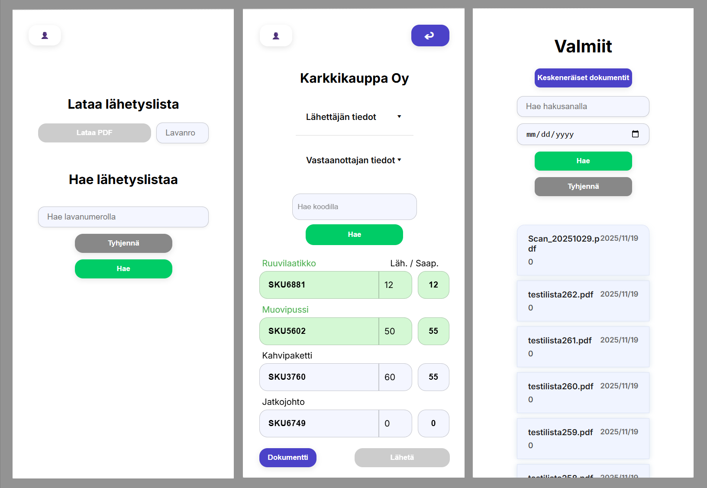

# DocuLens

DocuLens on lähetyslistojen digitalisointiohjelmisto, jonka avulla skannatut lähetyslistat voidaan ladata sovellukseen, niiden sisältävää tietoa voi tarkastella, muokata ja tallentaa. Esimiesnäkymässä (admin) pystyy myös näkemään ja tarkastelemaan valmiita, jo tarkastettuja lähetyslistoja.

# Alku

Projektin alussa Angular osaamista ei ollut ja ymmärrys hyvästä projektin kansiorakenteesta ja modulaarisuudesta olivat vähäisiä. API interaktioista oli vain pientä tietoa ja GitHub osaaminen oli olematonta.

# Oma kontribuutio

Oma roolini oli frontend kehittäjä, joten olin vastuussa frontend puolen toiminnallisuudesta. Testaajan rooli siirtyi itseltä pois kesken projektin työmäärän jaon tasauksen seurauksena.

## ?? Home --> Inspect-document navigaatio ?? 

Kun dokumenttia joko haetaan hakupalkilla lavanumerolla tai klikataan listasta admin näkymässä, otetaan kyseisen dokumentin id talteen, 
viedään se reittiparametrin kautta inspect-document sivulle ja haetaan API:sta id:tä käyttäen dokumenttiin liittyvä data ja alkuperäinen skannattu pdf. 
Relevantti data renderöidään sivulle muokattavassa muodossa. | Kuva tähän |

## Tuoterivien haku

Jotain tuoterivien hakufunktioista. | Kuva tähän |

# Mitä opin

## Tiimityöskentely

Projektin edetessä opin paremmaksi kommunikoijaksi, joka johtui tiimiläisiin tutustumisesta ja projektin itsensä paremmasta ymmärtämisestä. 

## Projektin muutokset / laajeneminen

Koska sovellukseen lisättiin projektin edetessä uusia ominaisuuksia, opin nopeasti että ennakointi ja hyvä suunnittelu on tärkeää. Kaikelta vanhan työn muuttamiselta ei voi välttyä, mutta hyvällä pohjatyöllä ja modulaarisuudella uuden implementointi helpottui huomattavasti.

### Storen käytön välttely

Koska sovelluksen data perustuu API kutsuihin (joka sivulla päivitetty data haetaan tietokannasta), ei sovelluksella aluksi ollut mitään jaettavaa dataa komponenttien välillä. Tämä muuttui myöhemmässä vaiheessa kun sovellukseen tuli id:n siirto yhdeltä sivulta toiselle ja admin näkymä, joka simuloi eri käyttäjien näkymiä eri sivuilla (Admin näkee enemmän tietoa).

Ratkaisuna molemmissa tapauksissa käytin reittiparametreja, koska ajattelin tapauksien olevan niin pienimuotoisia, että ne ei tarvitsisi erillistä storea (josta en Angularissa tiennyt mitään). Tämä laiskuus myöhemmässä vaiheessa kostautui, kun admin näkymä laajeni kaikille sivuille, jolloin jouduin reitityksen ja reittiparametrien kanssa tappelemaan, jotka ei lopulta jokaisessa tilanteessa toiminut. Jos tälle olisin alunperin tehnyt storen, niin tuleva ominaisuuden laajentaminen olisi ollut paljon yksinkertaisempaa.

| Kuva tähän |

## Uudet oivallukset
Vanhan korjaus / parannus kun enemmän osaamista löytyy

